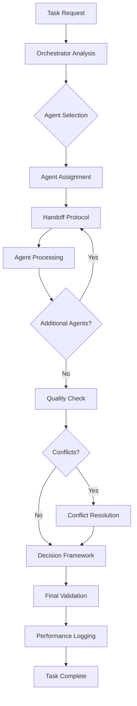

# Frontend Design Agent System - Workflow Overview

**Version:** 1.0.0
**Last Updated:** 2026-01-03
**System Version:** v1.0

## Table of Contents

- [System Architecture](#system-architecture)
- [Agent Ecosystem](#agent-ecosystem)
- [Workflow Patterns](#workflow-patterns)
- [Integration Points](#integration-points)
- [Core Protocols](#core-protocols)

---

## System Architecture

### High-Level Architecture

```
┌─────────────────────────────────────────────────────────────┐
│                    Context7 Orchestration Layer             │
│              (Action 3.01 - Unified Documentation)           │
└─────────────────────────────────────────────────────────────┘
                              │
         ┌────────────────────┼────────────────────┐
         │                    │                    │
         ▼                    ▼                    ▼
┌──────────────────┐  ┌──────────────────┐  ┌──────────────────┐
│ Handoff Protocol │  │ Context Sharing  │  │ Conflict Resol.  │
│  (Action 3.04)   │  │ Framework        │  │ Framework        │
└──────────────────┘  └──────────────────┘  └──────────────────┘
         │                    │                    │
         └────────────────────┼────────────────────┘
                              │
         ┌────────────────────┼────────────────────┐
         │                    │                    │
         ▼                    ▼                    ▼
┌──────────────────┐  ┌──────────────────┐  ┌──────────────────┐
│ Collaborative    │  │ Tool Delegation  │  │ Performance      │
│ Decision Prot.   │  │ Standards        │  │ Monitoring       │
└──────────────────┘  └──────────────────┘  └──────────────────┘
                              │
                              ▼
┌─────────────────────────────────────────────────────────────┐
│                    Agent Ecosystem (11 Agents)               │
│  1 Orchestrator + 10 Specialist Agents                      │
└─────────────────────────────────────────────────────────────┘
```

### Layer Responsibilities

**Context7 Orchestration Layer:**
- Centralized documentation management
- Library resolution and API references
- Knowledge base synchronization
- Version control integration

**Workflow Protocols Layer:**
- Agent handoff coordination
- Context state management
- Conflict resolution arbitration
- Decision framework orchestration
- Tool delegation routing

**Agent Ecosystem:**
- Task execution and processing
- Specialized domain expertise
- Tool usage and automation
- Performance metric reporting

---

## Agent Ecosystem

### Orchestrator Agent

**Agent:** Frontend Design Orchestrator
**Role:** Central coordination and decision-making hub
**Capabilities:**
- Workflow orchestration and routing
- Agent assignment and load balancing
- Performance monitoring integration
- Conflict escalation handling
- Context lifecycle management
- Task priority management

### Specialist Agents

#### 1. Design System Specialist
**Domain:** Design tokens, component libraries, visual consistency
**Tools:** Figma, Storybook, Style Dictionary, Chromatic
**Integration Points:** Context7 (design patterns), Performance (bundle analysis)

#### 2. Component Developer Specialist
**Domain:** React/Vue/Angular component implementation
**Tools:** Create React App, Vite, TypeScript, ESLint, Prettier
**Integration Points:** Testing (unit tests), Accessibility (a11y audits)

#### 3. Performance Optimizer Specialist
**Domain:** Performance metrics, optimization strategies
**Tools:** Lighthouse, WebPageTest, Bundle analyzer, Chrome DevTools
**Integration Points:** Monitoring (3.03), Context7 (performance patterns)

#### 4. Accessibility Specialist
**Domain:** WCAG compliance, screen reader support
**Tools:** axe, WAVE, Lighthouse a11y, screen reader testing
**Integration Points:** Testing (a11y tests), Context7 (a11y patterns)

#### 5. Cross-Platform Specialist
**Domain:** Browser compatibility, responsive design
**Tools:** BrowserStack, Cypress, Playwright, caniuse.com
**Integration Points:** Testing (cross-browser tests), Context7 (platform patterns)

#### 6. Testing & QA Specialist
**Domain:** Test strategy, quality assurance
**Tools:** Jest, Vitest, Cypress, Playwright, Testing Library
**Integration Points:** Performance (CI integration), Context7 (testing patterns)

#### 7. Security Specialist
**Domain:** Security audits, vulnerability scanning
**Tools:** Snyk, OWASP ZAP, npm audit, ESLint security plugins
**Integration Points:** Context7 (security patterns), Monitoring (security alerts)

#### 8. Animation Specialist
**Domain:** Motion design, animation implementation
**Tools:** Framer Motion, GSAP, CSS animations, Lottie
**Integration Points:** Performance (FPS monitoring), Context7 (animation patterns)

#### 9. Internationalization (i18n) Specialist
**Domain:** Localization, RTL support, translations
**Tools:** i18next, FormatJS, Crowdin, Transifex
**Integration Points:** Design System (locale support), Context7 (i18n patterns)

#### 10. UX Research Specialist
**Domain:** User testing, usability analysis
**Tools:** UserTesting, Hotjar, FullStory, Google Analytics
**Integration Points:** Performance (user metrics), Context7 (UX patterns)

---

## Workflow Patterns

### Pattern 1: Manager-Worker (Primary)

**Use Case:** Complex component development requiring multiple specializations

**Structure:**
```
Orchestrator → [Design System, Component Developer, Accessibility,
                Performance, Testing] → Orchestrator
```

**Example Workflow:** New component implementation

1. Orchestrator initiates task
2. Design System creates design tokens and specifications
3. Component Developer implements component
4. Accessibility validates compliance
5. Performance optimizes rendering
6. Testing creates test suite
7. Orchestrator reviews and integrates

**Estimated Duration:** 15-30 minutes

### Pattern 2: Pipeline

**Use Case:** Sequential refinement through specialized stages

**Structure:**
```
UX Research → Design System → Component Developer → Testing → Integration
```

**Example Workflow:** Feature implementation

1. UX Research provides user insights
2. Design System creates design specifications
3. Component Developer implements feature
4. Testing validates quality
5. Integration deploys to production

**Estimated Duration:** 20-45 minutes

### Pattern 3: Map-Reduce

**Use Case:** Large-scale analysis across multiple domains

**Structure:**
```
Orchestrator → [Accessibility, Performance, Security, Cross-Platform]
               → Orchestrator (aggregate results)
```

**Example Workflow:** Comprehensive audit

1. Orchestrator distributes audit tasks
2. Specialists execute parallel audits
3. Orchestrator aggregates findings
4. Orchestrator generates consolidated report

**Estimated Duration:** 10-20 minutes

### Pattern 4: Peer Review

**Use Case:** Quality-critical tasks requiring multiple validations

**Structure:**
```
Component Developer ↔ Accessibility ↔ Security → Testing → Orchestrator
```

**Example Workflow:** Component validation

1. Component Developer creates initial implementation
2. Accessibility validates and suggests changes
3. Component Developer refines based on a11y feedback
4. Security validates and suggests changes
5. Component Developer refines based on security feedback
6. Testing validates final implementation
7. Orchestrator approves for integration

**Estimated Duration:** 15-25 minutes

---

## Integration Points

### Context7 Integration (Action 3.01)

**Purpose:** Unified documentation and knowledge management

**API Endpoints:**
```
context7://resolve-library/{query}
context7://query-docs/{libraryId}/{topic}
context7://sync-context/{agentId}
context7://get-pattern/{domain}
```

**Workflow Integration:**
- Agents query Context7 for best practices before starting tasks
- Documentation references embedded in handoff contexts
- Pattern libraries synchronized across agents
- Knowledge gaps identified and logged

**Example Usage:**
```javascript
// Agent queries Context7 for performance patterns
const patterns = await Context7.queryDocs('/vercel/next.js',
  'performance optimization strategies');
```

### Performance Monitoring Integration (Action 3.03)

**Purpose:** Track workflow performance and agent efficiency

**Metrics Tracked:**
- Handoff completion time
- Agent response time
- Context synchronization latency
- Conflict resolution duration
- Tool usage efficiency
- Decision-making accuracy

**API Endpoints:**
```
monitoring://log-metric/{agentId}/{metric}/{value}
monitoring://get-agents-status
monitoring://get-workflow-stats
monitoring://set-alert/{condition}/{threshold}
```

**Dashboard Integration:**
- Real-time agent status display
- Workflow performance charts
- Conflict resolution analytics
- Tool usage heatmaps
- Decision accuracy trends

### Shared Testing Infrastructure (Action 3.02)

**Purpose:** Unified testing and validation framework

**Integration Points:**
- Testing Specialist coordinates all test execution
- Shared test fixtures and utilities
- Centralized test reporting
- Cross-agent test coverage tracking
- Performance regression detection

**API Endpoints:**
```
testing://run-tests/{suite}
testing://get-coverage/{component}
testing://register-test/{agentId}/{testFile}
testing://get-results/{runId}
```

---

## Core Protocols

### 1. Handoff Protocol (Document 01)

**Standardizes:** Agent-to-agent task delegation

**Key Features:**
- Structured handoff messages
- Context preservation
- Status acknowledgment
- Error handling
- Dependency management

**Location:** `/workflows/01-handoff-protocol-specification.md`

### 2. Context Sharing Framework (Document 02)

**Standardizes:** Context state management across agents

**Key Features:**
- Shared context data structures
- Versioning and synchronization
- Conflict resolution
- Access control
- Cache management

**Location:** `/workflows/02-context-sharing-architecture.md`

### 3. Conflict Resolution Framework (Document 03)

**Standardizes:** Handling competing recommendations

**Key Features:**
- Priority-based resolution
- Escalation procedures
- Consensus building
- Arbitration mechanisms
- Learning systems

**Location:** `/workflows/03-conflict-resolution-framework.md`

### 4. Collaborative Decision Protocols (Document 04)

**Standardizes:** Multi-agent decision-making

**Key Features:**
- Consensus protocols
- Weighted voting
- Expert authority
- Performance tracking
- Decision audit trails

**Location:** `/workflows/04-collaborative-decision-protocols.md`

### 5. Tool Delegation Standards (Document 05)

**Standardizes:** Tool usage and optimization

**Key Features:**
- Tool usage protocols
- Sharing and locking
- Performance monitoring
- Error handling
- Fallback strategies

**Location:** `/workflows/05-tool-delegation-standards.md`

---

## Workflow Execution Flow

### Typical Workflow Lifecycle



### Performance Targets

| Metric | Target | Alert Threshold |
|--------|--------|-----------------|
| Handoff Latency | < 500ms | > 1000ms |
| Agent Response | < 2s | > 5s |
| Context Sync | < 200ms | > 500ms |
| Conflict Resolution | < 30s | > 60s |
| Decision Making | < 10s | > 20s |

---

## Quick Reference

### File Structure

```
.workflows/
├── 00-workflow-system-overview.md          # This file
├── 01-handoff-protocol-specification.md    # Handoff procedures
├── 02-context-sharing-architecture.md      # Context management
├── 03-conflict-resolution-framework.md    # Conflict strategies
├── 04-collaborative-decision-protocols.md # Decision frameworks
├── 05-tool-delegation-standards.md        # Tool protocols
├── 06-implementation-guide.md             # Integration guide
├── 07-workflow-templates.md                # Reusable templates
└── 08-documentation.md                     # Reference docs
```

### Agent IDs

| Agent | ID |
|-------|-----|
| Orchestrator | `FD-ORC-01` |
| Design System | `FD-DS-02` |
| Component Developer | `FD-CD-03` |
| Performance Optimizer | `FD-PO-04` |
| Accessibility | `FD-AX-05` |
| Cross-Platform | `FD-CP-06` |
| Testing & QA | `FD-TQ-07` |
| Security | `FD-SC-08` |
| Animation | `FD-AN-09` |
| Internationalization | `FD-I1-10` |
| UX Research | `FD-UR-11` |

### Quick Links

- [Handoff Protocol](./01-handoff-protocol-specification.md)
- [Context Sharing](./02-context-sharing-architecture.md)
- [Conflict Resolution](./03-conflict-resolution-framework.md)
- [Collaborative Decisions](./04-collaborative-decision-protocols.md)
- [Tool Delegation](./05-tool-delegation-standards.md)
- [Implementation Guide](./06-implementation-guide.md)
- [Workflow Templates](./07-workflow-templates.md)
- [Documentation](./08-documentation.md)

---

## Version History

| Version | Date | Changes |
|---------|------|---------|
| 1.0.0 | 2026-01-03 | Initial release with complete workflow system |

---

## Next Steps

1. Review the [Handoff Protocol Specification](./01-handoff-protocol-specification.md)
2. Implement protocols in your agents following the [Implementation Guide](./06-implementation-guide.md)
3. Use [Workflow Templates](./07-workflow-templates.md) for common scenarios
4. Refer to [Documentation](./08-documentation.md) for detailed API references

---

**For questions or issues, please refer to the complete documentation set in the `.workflows/` directory.**
