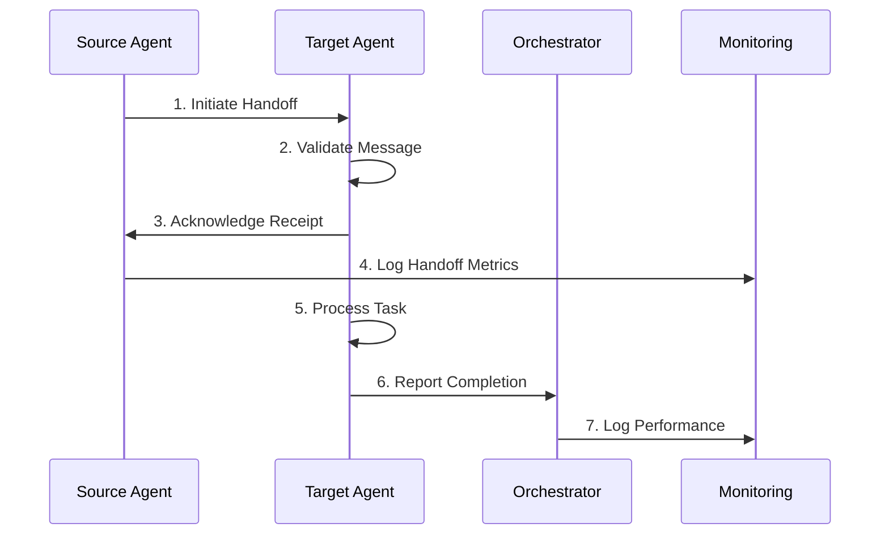
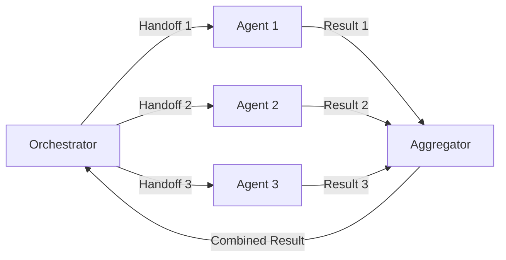

# Handoff Protocol Specification

**Version:** 1.0.0
**Protocol ID:** HP-FD-2024-001
**Last Updated:** 2026-01-03

## Table of Contents

- [Overview](#overview)
- [Handoff Message Format](#handoff-message-format)
- [Handoff Procedures](#handoff-procedures)
- [Context Preservation](#context-preservation)
- [Status Reporting](#status-reporting)
- [Error Handling](#error-handling)
- [Dependency Management](#dependency-management)
- [Performance Metrics](#performance-metrics)
- [Integration Examples](#integration-examples)

---

## Overview

### Purpose

Standardize agent-to-agent task delegation to ensure smooth transitions, complete information transfer, and reliable workflow execution across the Frontend Design Agent System.

### Goals

- **Zero Information Loss**: Complete context preservation during handoffs
- **Reliable Delivery**: Acknowledgment-based handoff confirmation
- **Traceability**: Complete audit trail of all handoffs
- **Efficiency**: Minimal handoff overhead (< 500ms latency)
- **Error Recovery**: Graceful handling of failed handoffs
- **Dependency Management**: Clear tracking of inter-agent dependencies

### Scope

Applies to all 11 agents in the Frontend Design Agent System:
- Frontend Design Orchestrator (FD-ORC-01)
- Design System Specialist (FD-DS-02)
- Component Developer Specialist (FD-CD-03)
- Performance Optimizer Specialist (FD-PO-04)
- Accessibility Specialist (FD-AX-05)
- Cross-Platform Specialist (FD-CP-06)
- Testing & QA Specialist (FD-TQ-07)
- Security Specialist (FD-SC-08)
- Animation Specialist (FD-AN-09)
- Internationalization Specialist (FD-I1-10)
- UX Research Specialist (FD-UR-11)

---

## Handoff Message Format

### Message Structure

```typescript
interface HandoffMessage {
  // Header
  message_id: string;                    // UUID v4
  protocol_version: string;             // "1.0.0"
  timestamp: string;                    // ISO 8601
  source_agent: string;                 // Agent ID (e.g., "FD-ORC-01")
  target_agent: string;                 // Agent ID (e.g., "FD-DS-02")
  workflow_id: string;                  // Workflow tracking ID

  // Core Content
  handoff_type: HandoffType;            // See HandoffType enum
  task: {
    id: string;                         // Task UUID
    title: string;                      // Human-readable title
    description: string;                // Detailed task description
    priority: TaskPriority;            // See TaskPriority enum
    estimated_duration: string;         // ISO 8601 duration (e.g., "PT10M")
    dependencies: string[];             // List of task IDs this depends on
    deliverables: string[];             // Expected outputs
  };

  // Context
  context: HandoffContext;              // See HandoffContext interface
  previous_work: WorkItem[];            // Work completed by previous agents

  // Metadata
  metadata: {
    workflow_stage: string;             // Current stage identifier
    stage_number: number;               // Stage index in workflow
    total_stages: number;               // Total stages in workflow
    retry_count: number;                // Number of retry attempts
    created_at: string;                 // Original task creation timestamp
    started_at: string;                 // Workflow start timestamp
  };

  // Constraints
  constraints: {
    deadline?: string;                  // ISO 8601 timestamp
    resource_limits?: ResourceLimits;   // CPU, memory, tool limits
    tool_restrictions?: string[];       // Tools not to use
    tool_requirements?: string[];      // Required tools
  };

  // Attachments (optional)
  attachments?: HandoffAttachment[];
}
```

### Enums and Interfaces

```typescript
enum HandoffType {
  INITIAL = "initial",                  // First agent in workflow
  SEQUENTIAL = "sequential",            // Standard sequential handoff
  PARALLEL_START = "parallel_start",    // Starting parallel execution
  PARALLEL_JOIN = "parallel_join",      // Joining parallel execution
  REVIEW = "review",                    // Peer review request
  CORRECTION = "correction",            // Request for corrections
  ESCALATION = "escalation",            // Escalating to orchestrator
  COMPLETION = "completion",            // Final handoff to orchestrator
  EMERGENCY = "emergency"               // Urgent handoff
}

enum TaskPriority {
  CRITICAL = "critical",                // Blocks other critical tasks
  HIGH = "high",                        // Important but not blocking
  MEDIUM = "medium",                    // Standard priority
  LOW = "low"                           // Can be deferred
}

interface HandoffContext {
  // Core Context
  project: {
    name: string;
    repository_url?: string;
    branch?: string;
    commit_hash?: string;
  };

  // Design Context
  design?: {
    system_version: string;
    tokens: Record<string, any>;
    components: string[];
    patterns: string[];
  };

  // Code Context
  code?: {
    files: string[];                    // Relevant file paths
    language: string;                   // Primary language
    framework: string;                  // Framework being used
    dependencies: Record<string, string>; // Package versions
  };

  // Performance Context
  performance?: {
    budget: PerformanceBudget;          // LCP, FID, CLS targets
    previous_metrics: Record<string, number>;
    constraints: string[];
  };

  // Accessibility Context
  accessibility?: {
    wcag_level: string;                 // "AA" or "AAA"
    requirements: string[];
    previous_issues: AccessibilityIssue[];
  };

  // Testing Context
  testing?: {
    framework: string;                  // Jest, Vitest, Cypress, etc.
    coverage_threshold: number;         // Target coverage %
    test_files: string[];
  };

  // User Context
  user?: {
    requirements: string[];
    personas: string[];
    use_cases: string[];
  };
}

interface WorkItem {
  agent_id: string;
  task_id: string;
  completed_at: string;
  outputs: {
    type: string;                       // "file", "config", "analysis"
    content: any;
    metadata: Record<string, any>;
  }[];
  notes: string;
}

interface PerformanceBudget {
  lcp: number;                          // Largest Contentful Paint (ms)
  fid: number;                          // First Input Delay (ms)
  cls: number;                          // Cumulative Layout Shift
  tti: number;                          // Time to Interactive (ms)
  ttfb: number;                         // Time to First Byte (ms)
}

interface AccessibilityIssue {
  wcag_criteria: string;
  severity: "critical" | "serious" | "moderate" | "minor";
  description: string;
  location: string;
}

interface HandoffAttachment {
  id: string;
  type: "file" | "image" | "url" | "data";
  name: string;
  content?: string;                     // For type: "data"
  path?: string;                        // For type: "file"
  url?: string;                         // For type: "url"
  size_bytes?: number;
  mime_type?: string;
}

interface ResourceLimits {
  max_cpu_percent: number;
  max_memory_mb: number;
  max_concurrent_tools: number;
  timeout_seconds: number;
}
```

---

## Handoff Procedures

### 1. Standard Sequential Handoff

**Use Case:** Normal workflow progression from one agent to another

**Procedure:**



**Step-by-Step:**

1. **Source Agent** creates handoff message
   - Generate unique `message_id` (UUID v4)
   - Populate all required fields
   - Include complete context
   - Attach any necessary files

2. **Target Agent** validates message
   ```typescript
   function validateHandoff(message: HandoffMessage): ValidationResult {
     // Check required fields
     if (!message.message_id || !message.task || !message.context) {
       return { valid: false, error: "Missing required fields" };
     }

     // Validate agent IDs
     if (!isValidAgentId(message.target_agent)) {
       return { valid: false, error: "Invalid target agent ID" };
     }

     // Check dependencies
     for (const dep of message.task.dependencies) {
       if (!isTaskComplete(dep)) {
         return { valid: false, error: `Dependency ${dep} not complete` };
       }
     }

     // Validate context structure
     if (!validateContextStructure(message.context)) {
       return { valid: false, error: "Invalid context structure" };
     }

     return { valid: true };
   }
   ```

3. **Target Agent** sends acknowledgment
   ```typescript
   interface HandoffAck {
     message_id: string;
     agent_id: string;
     timestamp: string;
     status: "accepted" | "rejected";
     reason?: string;
     estimated_completion: string;     // ISO 8601 duration
   }
   ```

4. **Source Agent** logs handoff to monitoring system

5. **Target Agent** processes task and reports completion

### 2. Parallel Handoff

**Use Case:** Multiple agents working simultaneously

**Procedure:**



**Implementation:**

```typescript
async function executeParallelHandoffs(
  orchestrator: string,
  targets: string[],
  baseMessage: HandoffMessage
): Promise<HandoffResult[]> {

  // Create parallel handoffs
  const handoffs = targets.map(target => ({
    ...baseMessage,
    message_id: generateUUID(),
    handoff_type: HandoffType.PARALLEL_START,
    source_agent: orchestrator,
    target_agent: target,
    metadata: {
      ...baseMessage.metadata,
      parallel_group_id: generateUUID(),
      parallel_members: targets,
    }
  }));

  // Execute in parallel
  const promises = handoffs.map(msg => initiateHandoff(msg));
  return Promise.all(promises);
}

async function aggregateResults(
  parallelGroupId: string
): Promise<AggregatedResult> {

  // Wait for all agents to complete
  const results = await waitForCompletion(parallelGroupId);

  // Combine results
  const aggregated: AggregatedResult = {
    group_id: parallelGroupId,
    agent_results: results,
    merged_context: mergeContexts(results.map(r => r.context)),
    conflicts: detectConflicts(results),
    summary: generateSummary(results)
  };

  return aggregated;
}
```

### 3. Review Handoff

**Use Case:** Peer review or quality assurance

**Procedure:**

```typescript
interface ReviewHandoff extends HandoffMessage {
  review: {
    type: "peer_review" | "qa" | "security" | "a11y";
    reviewer: string;                   // Agent ID of reviewer
    reviewee: string;                   // Agent ID being reviewed
    criteria: ReviewCriteria[];
    expected_findings: string[];        // Anticipated issues
  };
}

interface ReviewCriteria {
  id: string;
  category: string;
  description: string;
  weight: number;                       // Importance weight (1-10)
  pass_criteria: string;
}

interface ReviewResult {
  handoff_id: string;
  overall_score: number;                // 0-100
  passed: boolean;
  criteria_scores: Record<string, number>;
  findings: ReviewFinding[];
  recommendations: string[];
  approved: boolean;
}
```

### 4. Escalation Handoff

**Use Case:** Unresolvable conflicts or critical issues

**Procedure:**

```typescript
interface EscalationHandoff extends HandoffMessage {
  escalation: {
    level: "agent" | "orchestrator" | "system";
    reason: string;
    conflict_details: ConflictDetails;
    attempted_resolutions: ResolutionAttempt[];
    urgency: "low" | "medium" | "high" | "critical";
  };
}

interface ConflictDetails {
  conflicting_agents: string[];
  conflicting_recommendations: string[];
  context_snapshot: HandoffContext;
  impact_assessment: string;
}

interface ResolutionAttempt {
  timestamp: string;
  method: string;
  outcome: string;
  reason_for_failure?: string;
}
```

---

## Context Preservation

### Context Versioning

```typescript
interface ContextVersion {
  version_id: string;                   // Version UUID
  parent_version_id?: string;           // Previous version
  created_at: string;                   // ISO 8601
  created_by: string;                   // Agent ID
  changes: ContextChange[];
  checksum: string;                     // SHA-256 hash
}

interface ContextChange {
  path: string;                         // JSON path to changed field
  operation: "add" | "remove" | "replace" | "move" | "copy";
  old_value?: any;
  new_value?: any;
  reason: string;
}

class ContextManager {
  private versionHistory: Map<string, ContextVersion> = new Map();
  private currentVersion: string;

  async createContext(baseContext: HandoffContext): Promise<string> {
    const version: ContextVersion = {
      version_id: generateUUID(),
      created_at: new Date().toISOString(),
      created_by: getCurrentAgentId(),
      changes: [],
      checksum: calculateHash(baseContext)
    };

    this.versionHistory.set(version.version_id, version);
    this.currentVersion = version.version_id;

    return version.version_id;
  }

  async updateContext(
    updates: ContextChange[]
  ): Promise<string> {
    const parentVersion = this.currentVersion;

    const newVersion: ContextVersion = {
      version_id: generateUUID(),
      parent_version_id: parentVersion,
      created_at: new Date().toISOString(),
      created_by: getCurrentAgentId(),
      changes: updates,
      checksum: calculateHash(this.applyChanges(updates))
    };

    this.versionHistory.set(newVersion.version_id, newVersion);
    this.currentVersion = newVersion.version_id;

    return newVersion.version_id;
  }

  getVersion(versionId: string): ContextVersion | undefined {
    return this.versionHistory.get(versionId);
  }

  getHistory(): ContextVersion[] {
    return Array.from(this.versionHistory.values())
      .sort((a, b) => a.created_at.localeCompare(b.created_at));
  }

  async rollback(versionId: string): Promise<void> {
    const version = this.versionHistory.get(versionId);
    if (!version) {
      throw new Error(`Version ${versionId} not found`);
    }
    this.currentVersion = versionId;
  }
}
```

### Context Compression

For large contexts, implement compression before transmission:

```typescript
async function compressContext(context: HandoffContext): Promise<CompressedContext> {
  const serialized = JSON.stringify(context);

  // Check if compression is beneficial
  if (serialized.length < 1024) {  // Less than 1KB
    return {
      compressed: false,
      data: serialized,
      algorithm: "none"
    };
  }

  // Compress using gzip
  const compressed = await compress(serialized, { algorithm: "gzip" });

  return {
    compressed: true,
    data: compressed,
    algorithm: "gzip",
    original_size: serialized.length,
    compressed_size: compressed.length,
    compression_ratio: compressed.length / serialized.length
  };
}

interface CompressedContext {
  compressed: boolean;
  data: string;                       // Base64 encoded
  algorithm: "none" | "gzip" | "brotli";
  original_size?: number;
  compressed_size?: number;
  compression_ratio?: number;
}
```

---

## Status Reporting

### Handoff Status

```typescript
enum HandoffStatus {
  INITIATED = "initiated",
  SENT = "sent",
  ACKNOWLEDGED = "acknowledged",
  ACCEPTED = "accepted",
  REJECTED = "rejected",
  IN_PROGRESS = "in_progress",
  COMPLETED = "completed",
  FAILED = "failed",
  CANCELLED = "cancelled"
}

interface HandoffStatusReport {
  handoff_id: string;
  status: HandoffStatus;
  timestamp: string;
  agent_id: string;
  details?: {
    stage?: string;
    progress?: number;                // 0-100
    current_operation?: string;
    errors?: Error[];
  };
}

class HandoffTracker {
  private statuses: Map<string, HandoffStatusReport[]> = new Map();

  updateStatus(report: HandoffStatusReport): void {
    const history = this.statuses.get(report.handoff_id) || [];
    history.push(report);
    this.statuses.set(report.handoff_id, history);

    // Send to monitoring system
    Monitoring.logMetric("handoff_status", {
      handoff_id: report.handoff_id,
      status: report.status,
      agent: report.agent_id
    });
  }

  getStatus(handoff_id: string): HandoffStatusReport[] {
    return this.statuses.get(handoff_id) || [];
  }

  getCurrentStatus(handoff_id: string): HandoffStatusReport | undefined {
    const history = this.getStatus(handoff_id);
    return history[history.length - 1];
  }
}
```

### Progress Tracking

```typescript
interface ProgressUpdate {
  task_id: string;
  agent_id: string;
  timestamp: string;
  progress: number;                   // 0-100
  stage: string;
  details?: string;
  eta?: string;                        // ISO 8601 duration

  // Sub-task breakdown
  subtasks?: {
    id: string;
    name: string;
    status: "pending" | "in_progress" | "completed" | "failed";
    progress: number;
  }[];
}
```

---

## Error Handling

### Error Classification

```typescript
enum HandoffErrorType {
  VALIDATION_ERROR = "validation_error",
  NETWORK_ERROR = "network_error",
  CONTEXT_ERROR = "context_error",
  TIMEOUT_ERROR = "timeout_error",
  DEPENDENCY_ERROR = "dependency_error",
  PERMISSION_ERROR = "permission_error",
  RESOURCE_ERROR = "resource_error"
}

interface HandoffError {
  error_id: string;
  type: HandoffErrorType;
  timestamp: string;
  handoff_id: string;
  message: string;
  details?: any;
  stack_trace?: string;
  recoverable: boolean;
  retry_count: number;
  suggested_action?: string;
}
```

### Retry Strategy

```typescript
interface RetryPolicy {
  max_attempts: number;
  initial_delay_ms: number;
  max_delay_ms: number;
  backoff_multiplier: number;
  retryable_errors: HandoffErrorType[];
}

const DEFAULT_RETRY_POLICY: RetryPolicy = {
  max_attempts: 3,
  initial_delay_ms: 1000,
  max_delay_ms: 30000,
  backoff_multiplier: 2,
  retryable_errors: [
    HandoffErrorType.NETWORK_ERROR,
    HandoffErrorType.TIMEOUT_ERROR
  ]
};

async function executeHandoffWithRetry(
  message: HandoffMessage,
  policy: RetryPolicy = DEFAULT_RETRY_POLICY
): Promise<HandoffResult> {
  let attempt = 0;
  let delay = policy.initial_delay_ms;

  while (attempt < policy.max_attempts) {
    try {
      attempt++;
      const result = await executeHandoff(message);

      if (result.success) {
        return result;
      }

      if (!isRetryable(result.error, policy)) {
        throw result.error;
      }

    } catch (error) {
      if (!isRetryable(error, policy) || attempt >= policy.max_attempts) {
        throw error;
      }

      // Log retry attempt
      Monitoring.logMetric("handoff_retry", {
        handoff_id: message.message_id,
        attempt,
        delay,
        error: error.message
      });

      // Wait before retry
      await sleep(delay);
      delay = Math.min(delay * policy.backoff_multiplier, policy.max_delay_ms);
    }
  }

  throw new Error(`Handoff failed after ${attempt} attempts`);
}

function isRetryable(error: any, policy: RetryPolicy): boolean {
  return policy.retryable_errors.includes(error?.type);
}

function sleep(ms: number): Promise<void> {
  return new Promise(resolve => setTimeout(resolve, ms));
}
```

### Fallback Mechanisms

```typescript
async function executeWithFallback(
  primaryAgent: string,
  fallbackAgents: string[],
  message: HandoffMessage
): Promise<HandoffResult> {
  const agents = [primaryAgent, ...fallbackAgents];

  for (const agent of agents) {
    try {
      message.target_agent = agent;
      const result = await executeHandoffWithRetry(message);

      if (result.success) {
        Monitoring.logMetric("handoff_fallback_success", {
          primary: primaryAgent,
          actual: agent,
          handoff_id: message.message_id
        });

        return result;
      }

    } catch (error) {
      Monitoring.logMetric("handoff_agent_failed", {
        agent,
        error: error.message,
        handoff_id: message.message_id
      });
    }
  }

  throw new Error(`All handoff attempts failed for message ${message.message_id}`);
}
```

---

## Dependency Management

### Dependency Graph

```typescript
interface TaskDependency {
  task_id: string;
  depends_on: string[];
  dependents: string[];
  status: "pending" | "in_progress" | "completed" | "failed";
}

class DependencyManager {
  private graph: Map<string, TaskDependency> = new Map();

  addTask(taskId: string, dependencies: string[]): void {
    const dep: TaskDependency = {
      task_id: taskId,
      depends_on: dependencies,
      dependents: [],
      status: "pending"
    };

    this.graph.set(taskId, dep);

    // Update dependents
    for (const depId of dependencies) {
      const parent = this.graph.get(depId);
      if (parent && !parent.dependents.includes(taskId)) {
        parent.dependents.push(taskId);
      }
    }
  }

  getDependencies(taskId: string): string[] {
    const task = this.graph.get(taskId);
    return task?.depends_on || [];
  }

  getDependents(taskId: string): string[] {
    const task = this.graph.get(taskId);
    return task?.dependents || [];
  }

  canExecute(taskId: string): boolean {
    const dependencies = this.getDependencies(taskId);

    return dependencies.every(depId => {
      const dep = this.graph.get(depId);
      return dep?.status === "completed";
    });
  }

  setStatus(taskId: string, status: TaskDependency["status"]): void {
    const task = this.graph.get(taskId);
    if (task) {
      task.status = status;
    }
  }

  getReadyTasks(): string[] {
    return Array.from(this.graph.keys())
      .filter(taskId => this.canExecute(taskId));
  }

  getCriticalPath(): string[] {
    // Calculate longest path through dependency graph
    const visited = new Set<string>();
    const path: string[] = [];

    const dfs = (taskId: string): void => {
      if (visited.has(taskId)) return;

      const task = this.graph.get(taskId);
      if (!task) return;

      visited.add(taskId);

      // Recursively process dependencies
      for (const depId of task.depends_on) {
        dfs(depId);
      }

      path.push(taskId);
    };

    // Find tasks with no dependents (end nodes)
    for (const [taskId, task] of this.graph.entries()) {
      if (task.dependents.length === 0) {
        dfs(taskId);
      }
    }

    return path;
  }
}
```

### Circular Dependency Detection

```typescript
function detectCircularDependencies(
  dependencyManager: DependencyManager
): string[][] {
  const cycles: string[][] = [];
  const visited = new Set<string>();
  const recursionStack = new Set<string>();

  const detectCycle = (taskId: string, path: string[]): boolean => {
    visited.add(taskId);
    recursionStack.add(taskId);
    path.push(taskId);

    const dependencies = dependencyManager.getDependencies(taskId);

    for (const depId of dependencies) {
      if (!visited.has(depId)) {
        if (detectCycle(depId, [...path])) {
          return true;
        }
      } else if (recursionStack.has(depId)) {
        // Found a cycle
        const cycleStart = path.indexOf(depId);
        cycles.push(path.slice(cycleStart));
      }
    }

    recursionStack.delete(taskId);
    return false;
  };

  for (const taskId of dependencyManager.getTasks()) {
    if (!visited.has(taskId)) {
      detectCycle(taskId, []);
    }
  }

  return cycles;
}
```

---

## Performance Metrics

### Handoff Metrics

```typescript
interface HandoffMetrics {
  // Timing metrics
  handoff_initiated_at: string;
  handoff_completed_at: string;
  total_duration_ms: number;
  validation_duration_ms: number;
  processing_duration_ms: number;

  // Network metrics
  message_size_bytes: number;
  context_size_bytes: number;
  compressed_size_bytes?: number;
  transmission_time_ms: number;

  // Success metrics
  attempts: number;
  success: boolean;
  error_type?: HandoffErrorType;

  // Context metrics
  context_version_id: string;
  context_changes_count: number;
  context_fields_count: number;

  // Agent metrics
  source_agent: string;
  target_agent: string;
  agent_response_time_ms: number;
}

class HandoffMetricsCollector {
  async collectMetrics(handoffId: string): Promise<HandoffMetrics> {
    const history = HandoffTracker.getStatus(handoffId);

    // Calculate durations
    const initiated = history.find(r => r.status === HandoffStatus.INITIATED);
    const completed = history.find(r => r.status === HandoffStatus.COMPLETED);

    return {
      handoff_initiated_at: initiated?.timestamp || "",
      handoff_completed_at: completed?.timestamp || "",
      total_duration_ms: calculateDuration(initiated, completed),
      validation_duration_ms: this.getStageDuration(history, "validation"),
      processing_duration_ms: this.getStageDuration(history, "processing"),
      // ... more metrics
    };
  }

  private getStageDuration(
    history: HandoffStatusReport[],
    stage: string
  ): number {
    // Calculate duration for specific stage
    const start = history.find(r => r.details?.stage === stage && r.details?.progress === 0);
    const end = history.find(r => r.details?.stage === stage && r.details?.progress === 100);

    if (!start || !end) return 0;

    return new Date(end.timestamp).getTime() - new Date(start.timestamp).getTime();
  }
}
```

### Performance Targets

| Metric | Target | Warning | Critical |
|--------|--------|---------|----------|
| Total Handoff Duration | < 500ms | > 1000ms | > 2000ms |
| Validation Duration | < 100ms | > 200ms | > 500ms |
| Transmission Time | < 50ms | > 100ms | > 200ms |
| Agent Response Time | < 2s | > 5s | > 10s |
| Retry Rate | < 5% | > 10% | > 20% |
| Failure Rate | < 1% | > 5% | > 10% |

---

## Integration Examples

### Example 1: Component Development Workflow

```typescript
// Step 1: Orchestrator initiates component development
const handoff1: HandoffMessage = {
  message_id: generateUUID(),
  protocol_version: "1.0.0",
  timestamp: new Date().toISOString(),
  source_agent: "FD-ORC-01",
  target_agent: "FD-DS-02",
  workflow_id: "WF-COMP-001",

  handoff_type: HandoffType.INITIAL,
  task: {
    id: generateUUID(),
    title: "Create Button Component",
    description: "Design and implement a reusable button component",
    priority: TaskPriority.HIGH,
    estimated_duration: "PT20M",
    dependencies: [],
    deliverables: ["design-spec", "component-code", "tests"]
  },

  context: {
    project: {
      name: "Project X",
      repository_url: "https://github.com/user/project-x"
    },
    design: {
      system_version: "2.0.0",
      tokens: {
        colors: { primary: "#007bff" },
        spacing: { md: "1rem" }
      }
    }
  },

  previous_work: [],
  metadata: {
    workflow_stage: "design",
    stage_number: 1,
    total_stages: 4,
    retry_count: 0,
    created_at: new Date().toISOString(),
    started_at: new Date().toISOString()
  }
};

// Step 2: Design System creates specifications
const result1 = await executeHandoffWithRetry(handoff1);

// Step 3: Handoff to Component Developer
const handoff2: HandoffMessage = {
  ...handoff1,
  message_id: generateUUID(),
  source_agent: "FD-DS-02",
  target_agent: "FD-CD-03",
  handoff_type: HandoffType.SEQUENTIAL,
  metadata: {
    ...handoff1.metadata,
    workflow_stage: "implementation",
    stage_number: 2
  },
  previous_work: [
    {
      agent_id: "FD-DS-02",
      task_id: handoff1.task.id,
      completed_at: new Date().toISOString(),
      outputs: [
        {
          type: "file",
          content: { file_path: "design/Button.spec.json" },
          metadata: {}
        }
      ],
      notes: "Design specification completed"
    }
  ]
};

// Step 4: Component Developer implements
const result2 = await executeHandoffWithRetry(handoff2);
```

### Example 2: Parallel Performance Audit

```typescript
// Orchestrator initiates parallel audit
const baseMessage: HandoffMessage = {
  message_id: generateUUID(),
  protocol_version: "1.0.0",
  timestamp: new Date().toISOString(),
  source_agent: "FD-ORC-01",
  target_agent: "",  // Will be set for each parallel handoff
  workflow_id: "WF-AUDIT-001",

  handoff_type: HandoffType.PARALLEL_START,
  task: {
    id: generateUUID(),
    title: "Performance Audit",
    description: "Comprehensive performance audit of the application",
    priority: TaskPriority.HIGH,
    estimated_duration: "PT15M",
    dependencies: [],
    deliverables: ["audit-report"]
  },

  context: {
    project: {
      name: "Project X"
    },
    performance: {
      budget: {
        lcp: 2500,
        fid: 100,
        cls: 0.1,
        tti: 3000,
        ttfb: 600
      }
    }
  },

  previous_work: [],
  metadata: {
    workflow_stage: "audit",
    stage_number: 1,
    total_stages: 2,
    retry_count: 0,
    created_at: new Date().toISOString(),
    started_at: new Date().toISOString()
  }
};

// Execute parallel handoffs
const targets = ["FD-PO-04", "FD-AX-05", "FD-SC-08"];
const parallelResults = await executeParallelHandoffs(
  "FD-ORC-01",
  targets,
  baseMessage
);

// Wait for completion and aggregate
const aggregated = await aggregateResults(
  baseMessage.metadata.parallel_group_id
);

// Create final handoff to Orchestrator
const finalHandoff: HandoffMessage = {
  ...baseMessage,
  message_id: generateUUID(),
  handoff_type: HandoffType.PARALLEL_JOIN,
  previous_work: aggregated.agent_results.map(r => ({
    agent_id: r.agent_id,
    task_id: r.task_id,
    completed_at: r.completed_at,
    outputs: r.outputs,
    notes: r.notes
  }))
};

await executeHandoff(finalHandoff);
```

---

## Implementation Checklist

- [ ] Implement HandoffMessage interface
- [ ] Implement HandoffAck mechanism
- [ ] Implement validation logic
- [ ] Implement context versioning
- [ ] Implement retry strategy
- [ ] Implement fallback mechanisms
- [ ] Implement dependency management
- [ ] Implement metrics collection
- [ ] Integrate with monitoring system
- [ ] Add comprehensive error handling
- [ ] Create unit tests for all components
- [ ] Document agent-specific workflows
- [ ] Train agents on handoff protocols

---

## Version History

| Version | Date | Changes |
|---------|------|---------|
| 1.0.0 | 2026-01-03 | Initial release with complete handoff protocol |

---

**Related Documents:**
- [Context Sharing Architecture](./02-context-sharing-architecture.md)
- [Conflict Resolution Framework](./03-conflict-resolution-framework.md)
- [Implementation Guide](./06-implementation-guide.md)
